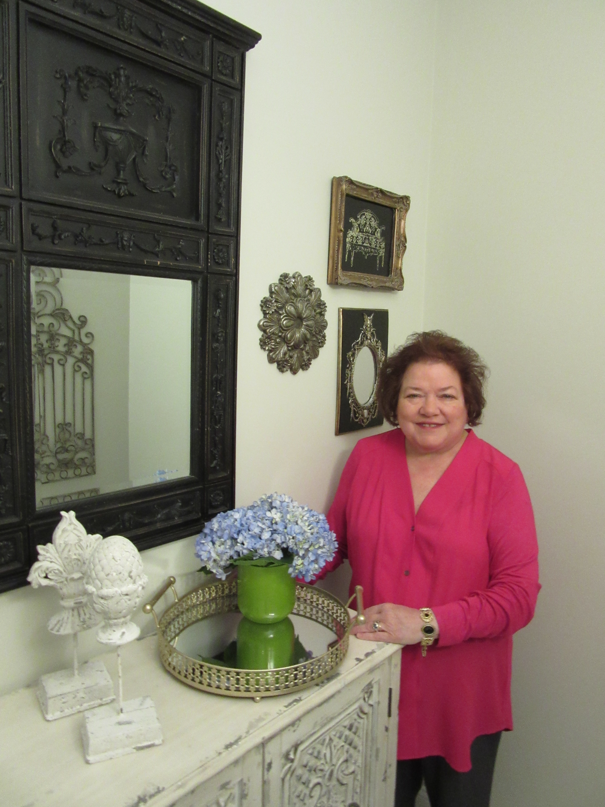

Becky Barras Interior Design is a full service design firm established in 1994.

My style philosophy cannot be contained in one simple phrase. Each client I work with brings their special perspective to each project. Through communication, I take the time to develop a genuine understanding of their lifestyle and personality in order to create a personal, beautiful and complete space.

My background includes award winning design on both residential and commercial projects. With a degree in Interior Design specializing in textiles, I am able to work from creative conceptualization to design implementation. Each project is approached with enthusiasm, sincerity and humor, important elements in life as well as design.